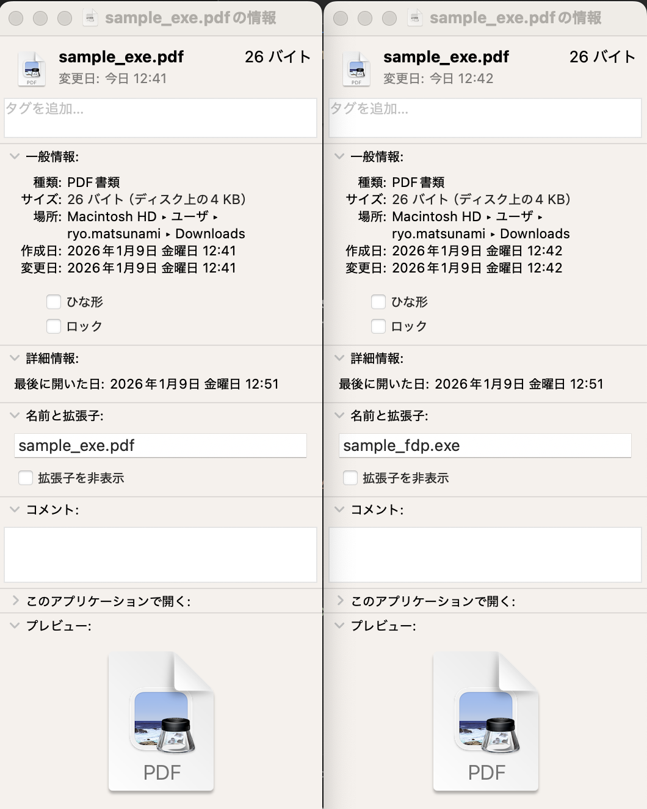
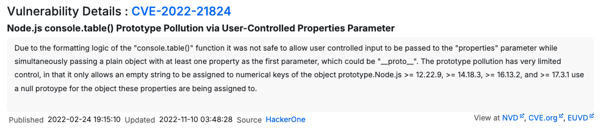

# Code Reliability

## この if 文を突破できる？

### TypeScriptで学ぶコードの脆弱性

<div class="mt-12 py-1">
  Security.any #08 目指しているセキュリティLT<br>
  2026.01.27
</div>

---
layout: default
transition: fade-out
---

# RYO

<div>
  <h3>Hi!!👋</h3>

  <ui>
    <li>SRE / Security Engineer</li>
    <li>某人材系企業にて転職支援・案件紹介サービスの開発に従事</li>
    <li>主にAWS環境のセキュリティ品質の改善や雑務・雑用を1人で担当</li>
    <li>好きな技術は <svg xmlns="http://www.w3.org/2000/svg" width="32" height="32" viewBox="0 0 32 32"><!-- Icon from VSCode Icons by Roberto Huertas - https://github.com/vscode-icons/vscode-icons/blob/master/LICENSE --><path fill="#41b883" d="M24.4 3.925H30l-14 24.15L2 3.925h10.71l3.29 5.6l3.22-5.6Z"/><path fill="#41b883" d="m2 3.925l14 24.15l14-24.15h-5.6L16 18.415L7.53 3.925Z"/><path fill="#35495e" d="M7.53 3.925L16 18.485l8.4-14.56h-5.18L16 9.525l-3.29-5.6Z"/></svg> <svg xmlns="http://www.w3.org/2000/svg" width="32" height="32" viewBox="0 0 32 32"><!-- Icon from VSCode Icons by Roberto Huertas - https://github.com/vscode-icons/vscode-icons/blob/master/LICENSE --><path fill="#813cf3" d="m12.042 6.858l8.029 4.59v9.014l-8.029-4.594zM20.5 20.415l7.959-4.575V6.887L20.5 11.429zM3.541 11.01l8.03 4.589V6.59L3.541 2zm8.501 14.4L20.071 30v-9.043l-8.029-4.589z"/></svg> <svg xmlns="http://www.w3.org/2000/svg" width="32" height="32" viewBox="0 0 128 128"><!-- Icon from Devicon by konpa - https://github.com/devicons/devicon/blob/master/LICENSE --><path fill="#2777ff" d="M68.15 31.699s-10.512-.7-28.411 4.901c-18.242 5.708-28.587 13.798-28.587 13.798s27.188-15.18 57.876-16.043zm39.206 16.505l1.367-.09s-7.83-9.499-22.815-14.126c8.424 3.424 15.756 7.961 21.448 14.215zm2.237 3.946c.21-.364.888 1.158 1.403 1.797c.022.128.058.205-.24.144c-.026-.131-.069-.17-.069-.17s-.72-.428-.942-.732c-.22-.305-.26-.837-.152-1.039m18.39 45.218s1.662-19.081-28.317-23.48a97.5 97.5 0 0 0-13.465-1c-24.029.318-24.905-27.713-6.798-29.128c7.503-.62 16.463 3.429 25.223 7.508c-.033 1.088.012 2.055.727 2.948s3.46 1.867 4.336 2.37s3.687 2.29 5.409 4.531c.373-.698 3.491-2.728 3.491-2.728s-.747.016-2.485-.633c-1.738-.65-3.8-2.615-3.849-2.728c-.048-.114-.08-.292.325-.374c.309-.26-.39-1.104-.698-1.412c-.309-.309-2.371-3.816-2.42-3.898c-.049-.08-.065-.162-.211-.26c-.455-.146-2.453.212-2.453.212s-3.072-1.51-4.13-4.762c.015.57-.527 1.192 0 2.5c-1.603-.677-2.978-1.833-4.064-4.689c-.646 1.625 0 2.658 0 2.658s-3.772-1.054-4.375-4.533c-.662 1.562 0 2.5 0 2.5s-6.15-3.208-16.367-3.254c-6.841-.628-8.265-12.662-7.631-14.688c0 0-9.867-5.2-29.29-7.497c-19.424-2.298-35.353-.346-35.353-.346s34.4-1.651 61.96 9.506c.936 4.19 3.754 11.169 5.272 14.523c-4.343 3.004-9.241 5.827-10.004 15.843s7.848 18.824 18.526 19.095c10.139.54 17.144.617 25.635 5.02c8.105 4.48 14.75 18.136 15.408 30.417c.71-9.112-2.71-28.707-18.666-34.656c22.302 3.902 24.264 20.436 24.264 20.436zM67.624 30.202l-.802-2.588s-13.241-2.351-31.044-1.086C17.975 27.794 0 34.025 0 34.025s36.78-9.254 67.624-3.823"/></svg></li>
    <li>趣味はドライブ・ランニング・Webサイト構築・英語などなど...</li>
    <li>子供が生まれてからは自分の時間をあまり持ててないのが悩み...</li>
  </ui>

  
</div>

<style>
ui:first-of-type {
  list-style-type: custom-style-types;
}
@counter-style custom-style-types {
  system: cyclic;
  symbols: 👨 🏢 📖 💡 🚗 👨‍👩‍👧‍👦;
  suffix: " ";
}

img {
  border-radius: 50%;
  width: 150px;
  position: absolute;
  right: 150px;
  top: 100px;
}
h2 {
  color: #eee;
  font-size: 50px;
  font-family: "Noto Sans";
  margin-bottom: 20px;
}
h3 {
  color: grey;
  margin-bottom: 40px;
}
svg {
  width: 30px;
  height: 30px;
  display: inline-block;
}
</style>

---
layout: center
transition: fade-out
---

<div>
  <p v-click class="p-1">👍 自分はどちらかと言えば好きな方</p>
</div>

# コードを書くことは好きですか？

<div>
  <p v-click class="p-2">👎 でも得意ではない（上手くない）</p>
</div>

<style>
.p-1 {
  text-align: center;
  margin-bottom: 80px;
}
.p-2 {
  text-align: center;
  margin-top: 80px;
  color: grey;
}
</style>

---
layout: center
transition: fade-out
---

<div>
  <svg v-motion :initial="{ scale: 1.0, opacity: 0, transition: { delay: 1500 } }" :enter="{ scale: 1.5, opacity: 1 }" xmlns="http://www.w3.org/2000/svg" width="32" height="32" viewBox="0 0 128 128"><!-- Icon from Devicon by konpa - https://github.com/devicons/devicon/blob/master/LICENSE --><path fill="url(#SVGWy8Dkdne)" d="M62.086 11.967c-13.555.497-27.04 5.525-36.486 15.43c-8.17 8.565-10.477 20.475-11.471 31.91a.32.32 0 0 1-.34.293c-4.381-.277-6.773 1.599-9.31 5.03C2.573 67.21.41 69.527 0 72.866v15.57q.366 2.766 2.277 4.159c12.054 8.812 25.851 15.992 40.202 20.25q18.12 5.37 36.423 1.695c16.747-3.364 33.124-11.724 46.702-21.885c1.956-1.464 2.36-3.278 2.373-5.83q.05-11.618-.01-13.84c-.084-3.258-3.237-6.729-5.194-9.31c-2.203-2.912-4.887-4.289-8.61-4.08a.32.32 0 0 1-.34-.299a82.7 82.7 0 0 0-2.92-16.748c-5.617-19.879-25.84-29.758-45.128-30.58h-3.69zm21.783 14.078c5.044-.13 10.4.96 14.444 3.662c5.6 3.74 5.852 13.579 4.777 19.363c-.526 2.839-1.157 4.914-3.514 6.366c-4.343 2.674-10.084 2.91-14.898 1.654c-3.721-.97-8.543-3.604-10.58-7.17c-2.483-4.347-2.71-11.435-1.684-16.2c.799-3.688 2.695-6.4 6.576-7.152c1.552-.3 3.198-.48 4.88-.523zm-40.924.014c2.412-.021 4.73.22 6.696.646c6.53 1.41 6.983 10.976 6.271 16.12c-.542 3.932-1.486 7.48-4.404 9.937c-6.275 5.274-16.827 7.235-23.906 2.13c-.96-.69-1.716-2.025-2.079-3.257q-2.341-8 .036-16.074c2.062-7.002 10.151-9.44 17.386-9.502m21.053 13.96q2.082-.001 4.164.196a.33.33 0 0 1 .227.127a.32.32 0 0 1 .059.252a16.4 16.4 0 0 0-.235 4.402a.33.33 0 0 1-.21.328a.3.3 0 0 1-.136.018a47.5 47.5 0 0 0-7.744-.004a.3.3 0 0 1-.137-.018a.32.32 0 0 1-.209-.324a17.3 17.3 0 0 0-.228-4.402a.33.33 0 0 1 .16-.336a.3.3 0 0 1 .125-.04a44 44 0 0 1 4.164-.198zm-.018 11.358a46 46 0 0 1 4.963.273a.315.315 0 0 1 .278.248c.805 3.503 2.59 5.904 5.595 8.036c6.438 4.564 15.863 5.904 23.051 1.775a.32.32 0 0 1 .256-.03c3.285 1.025 5.298 2.437 5.459 6.145q.507 11.655.404 25.205c-.016 2.167-.134 4.637-2.363 5.725q-9.049 4.427-20.22 7.156c-18.566 4.533-37.007 1.21-54.12-6.742c-1.982-.921-3.281-2.232-3.271-4.393c.042-8.882.06-17.766.38-26.642c.139-3.843 1.959-5.394 5.467-6.444a.33.33 0 0 1 .246.03c7.712 4.305 17.562 2.68 24.247-2.658q3.422-2.733 4.384-7.166a.33.33 0 0 1 .28-.25a46 46 0 0 1 4.964-.268M50.523 73.389c-2.559.062-5.095 1.897-5.187 4.972q-.113 3.674.002 9.147q.043 1.924.514 2.931c1.86 3.985 7.864 3.791 9.468-.293q.408-1.04.414-3.755q.005-3.487-.011-6.973q-.011-1.86-.328-2.707c-.878-2.347-2.881-3.37-4.872-3.322m26.418.04a4.9 4.9 0 0 0-4.896 4.9v10.056a4.9 4.9 0 0 0 4.896 4.898h.526a4.896 4.896 0 0 0 4.894-4.898V78.328a4.896 4.896 0 0 0-4.894-4.898h-.526z"/><defs><linearGradient id="SVGWy8Dkdne" x1="527.926" x2="527.926" y1="275" y2="421.221" gradientTransform="translate(-311.724 -183.75)scale(.7117)" gradientUnits="userSpaceOnUse"><stop stop-color="#93f5ec"/><stop offset="1" stop-color="#9bc8ee"/></linearGradient></defs></svg>
  <svg v-motion :initial="{ scale: 1.0, opacity: 0, transition: { delay: 1500 } }" :enter="{ scale: 1.5, opacity: 1 }" xmlns="http://www.w3.org/2000/svg" width="31.88" height="32" viewBox="0 0 256 257"><!-- Icon from SVG Logos by Gil Barbara - https://raw.githubusercontent.com/gilbarbara/logos/master/LICENSE.txt --><path fill="#D97757" d="m50.228 170.321l50.357-28.257l.843-2.463l-.843-1.361h-2.462l-8.426-.518l-28.775-.778l-24.952-1.037l-24.175-1.296l-6.092-1.297L0 125.796l.583-3.759l5.12-3.434l7.324.648l16.202 1.101l24.304 1.685l17.629 1.037l26.118 2.722h4.148l.583-1.685l-1.426-1.037l-1.101-1.037l-25.147-17.045l-27.22-18.017l-14.258-10.37l-7.713-5.25l-3.888-4.925l-1.685-10.758l7-7.713l9.397.649l2.398.648l9.527 7.323l20.35 15.75L94.817 91.9l3.889 3.24l1.555-1.102l.195-.777l-1.75-2.917l-14.453-26.118l-15.425-26.572l-6.87-11.018l-1.814-6.61c-.648-2.723-1.102-4.991-1.102-7.778l7.972-10.823L71.42 0l10.63 1.426l4.472 3.888l6.61 15.101l10.694 23.786l16.591 32.34l4.861 9.592l2.592 8.879l.973 2.722h1.685v-1.556l1.36-18.211l2.528-22.36l2.463-28.776l.843-8.1l4.018-9.722l7.971-5.25l6.222 2.981l5.12 7.324l-.713 4.73l-3.046 19.768l-5.962 30.98l-3.889 20.739h2.268l2.593-2.593l10.499-13.934l17.628-22.036l7.778-8.749l9.073-9.657l5.833-4.601h11.018l8.1 12.055l-3.628 12.443l-11.342 14.388l-9.398 12.184l-13.48 18.147l-8.426 14.518l.778 1.166l2.01-.194l30.46-6.481l16.462-2.982l19.637-3.37l8.88 4.148l.971 4.213l-3.5 8.62l-20.998 5.184l-24.628 4.926l-36.682 8.685l-.454.324l.519.648l16.526 1.555l7.065.389h17.304l32.21 2.398l8.426 5.574l5.055 6.805l-.843 5.184l-12.962 6.611l-17.498-4.148l-40.83-9.721l-14-3.5h-1.944v1.167l11.666 11.406l21.387 19.314l26.767 24.887l1.36 6.157l-3.434 4.86l-3.63-.518l-23.526-17.693l-9.073-7.972l-20.545-17.304h-1.36v1.814l4.73 6.935l25.017 37.59l1.296 11.536l-1.814 3.76l-6.481 2.268l-7.13-1.297l-14.647-20.544l-15.1-23.138l-12.185-20.739l-1.49.843l-7.194 77.448l-3.37 3.953l-7.778 2.981l-6.48-4.925l-3.436-7.972l3.435-15.749l4.148-20.544l3.37-16.333l3.046-20.285l1.815-6.74l-.13-.454l-1.49.194l-15.295 20.999l-23.267 31.433l-18.406 19.702l-4.407 1.75l-7.648-3.954l.713-7.064l4.277-6.286l25.47-32.405l15.36-20.092l9.917-11.6l-.065-1.686h-.583L44.07 198.125l-12.055 1.555l-5.185-4.86l.648-7.972l2.463-2.593l20.35-13.999z"/></svg>
  <svg v-motion :initial="{ scale: 1.0, opacity: 0, transition: { delay: 1500 } }" :enter="{ scale: 1.5, opacity: 1 }" xmlns="http://www.w3.org/2000/svg" width="32" height="32" viewBox="0 0 32 32"><!-- Icon from VSCode Icons by Roberto Huertas - https://github.com/vscode-icons/vscode-icons/blob/master/LICENSE --><path fill="#444" d="M3.75 9v14h24.5V9L16 2"/><path fill="#939393" d="M16 16V2L3.75 9l24.5 14L16 30L3.75 23"/><path fill="#e3e3e3" d="M28.25 9H16v21"/><path fill="#fff" d="M3.75 9h24.5L16 16"/></svg>
</div>

<style>
svg {
  display: inline-block;
  width: 50px;
  height: 50px;
  margin: 50px;
}
</style>

---
layout: two-cols
layoutClass: gap-16
transition: fade-out
---

# Vibe Coding

<div>
  昨今では、開発者の直感や雰囲気（Vibe）をAIに伝えて、対話しながらコードを実装するバイブコーディング（Vibe Coding）が主流になってきた。
</div>

<br>

<div v-click>
  ただ、AIは「最もらしい答え」を出すが「正しい保証」はしない。<br>
  AIが生成したコードに脆弱性が含まれる可能性は十分にある。
</div>

<br>

<div v-click>
  コードの信頼性・堅牢性を保つには、やはり現在でも開発者の<span v-mark.circle.orange="3">「コードの理解」</span>が求められている。（と思う。）
</div>

::right::

<div>
  
</div>

---
layout: center
transition: fade-out
---

## コード、どれだけ理解していますか？ 🕵️‍♀️

---
layout: default
transition: fade-out
---

# Quiz

<div>
  これからTypeScriptで実装されたif文を含むコードを元にいくつかクイズを出します。
</div>

<br>

<div v-click>
  どうすれば条件式が <code>true</code> を返すか考えてみてください。<br>
  コードの理解があれば回答できるはずです。
</div>

<br>

<div v-click>
  例題です。次のコードで<code>🎉 success!!</code>を出力させるには、<code>example()</code>に渡す最小の整数は何でしょう？<br>

```ts {monaco-run}
const example = (num: number) => {
  if (num === num + 1) {
    console.log("🎉 success!!");
  } else {
    console.log("❌ failed!!");
  }
}

example(?)
```

</div>

<!--
9007199254740992
-->

---
layout: center
transition: fade-out
---

## Question 1

---
layout: default
transition: fade-out
---

# Question 1

<div>
  次のコードで<code>🎉 success!!</code>を出力させるには、<code>question()</code>に渡す文字列は何でしょう？<br>
  <code>"A"</code>以外にも正解があります。
</div>

<br>

<div>

```ts {monaco-run}
const question = (str: string) => {
  if ("A" === str) {
      console.log("🎉 success!!")
  } else {
      console.log("❌ failed!!")
  }
}

question(?)
```

</div>

<!--
\u0041 (Unicode) <br>
\u{41} (Unicode) <br>
\x41 (Hex) <br>
String.fromCharCode(65) (fromCharCode) <br>
atob("QQ==") (Base64) <br>
((0/0)+[])[1].toUpperCase() (NaN trick)
-->

---
layout: center
transition: fade-out
---

# Answer

---
layout: default
transition: fade-out
---

# Answer

<div>
  <code>"\u0041", "\u{41}", "\x41"</code> などが正解。
</div>

<br>

<div>

```ts {monaco-run}
console.log("A" === "\u0041"); // Unicodeエスケープ
console.log("A" === "\u{41}"); // Unicodeコードポイント
console.log("A" === "\x41");   // 16進数エスケープ
```

</div>

<br>

<div v-click>
  Unicodeは1つの文字を複数の異なる文字で表現したり、見えない文字（制御文字）を表現できる。<br>
  世の中にはUnicodeを悪用した攻撃がいくつか存在する。
</div>

<!--
https://medium.com/@instatunnel/unicode-normalization-attacks-when-admin-admin-32477c36db7f
https://techracho.bpsinc.jp/hachi8833/2021_09_08/48435
https://www.jpcert.or.jp/java-rules/ids01-j.html
-->

---
layout: default
transition: fade-out
---

# Homograph Attacks

<div>
  ホモグラフ攻撃 (Homograph Attacks) は視覚的に似ているUnicode文字を悪用して、偽のドメイン名を取得する手法です。<br>
  ユーザを騙して偽のウェブサイトに誘導したりフィッシング詐欺に利用される。
</div>

<br>

<div v-click>
  次のURLはどちらが本物でしょうか？<br>
  <ul>
    <li><code>https://www.google.com/</code></li>
    <li><code>https://www.gоogle.com/</code></li>
  </ul>
</div>

<br>

<div v-click>
  上が本物、下が偽物です。
</div>

<style>
ul {
  margin-top: 15px;
  margin-left: 10px;
}
li {
  font-size: 20px;
}
</style>

---
layout: default
transition: fade-out
---

# RLO Attacks

<div>
  RLO攻撃（RLO Attacks）はUnicode特殊文字を悪用してファイル名やURLを欺く手法です。<br>
  RLO = Right-to-Left Override のことで、文字を逆転させる。
</div>

<br>

<div v-click>
  同じディレクトリ内に同じ名前のPDFがあります。どちらが本物のPDFでしょうか？<br>
  
</div>

<br>
<br>

<div v-click>
  Finderの「情報を見る」と本物がわかる。<br>
  
  <span v-motion :initial="{ opacity: 0, transition: { delay: 2000 } }" :enter="{ opacity: 1 }" class="span-1"></span>
  <span v-motion :initial="{ opacity: 0, transition: { delay: 2000 } }" :enter="{ opacity: 1 }" class="span-2"></span>
</div>

<style>
.image-1 {
  margin: 10px;
  border-radius: 10px;
  width: 400px;
}
.image-2 {
  border-radius: 10px;
  width: 400px;
  position: absolute;
  bottom: 5px;
  right: 50px;
}
.span-1 {
  border-radius: 5px;
  border: dashed 1px red;
  width: 190px;
  height: 20px;
  position: absolute;
  bottom: 220px;
  right: 255px;
}
.span-2 {
  border-radius: 5px;
  border: dashed 1px red;
  width: 190px;
  height: 20px;
  position: absolute;
  bottom: 220px;
  right: 55px;
}
</style>

<!--
node -e "require('fs').writeFileSync('test_\u202Efdp.exe', 'This is a fake PDF content')"
-->

---
layout: default
transition: fade-out
---

# Unicode Normalization Attacks

<div>
  Unicode正規化攻撃（Unicode Normalization Attack）はUnicodeを巧妙に使い分けて、アプリケーションの文字列比較やフィルタリング処理をすり抜けて不正な入力を通す手法です。
</div>

<br>

<div v-click>
  タグの有無を判定するバリデーションチェックを例に、脆弱な実装と適切な実装を比べてみます。
</div>

<br>

````md magic-move {lines: true}
```ts {*|16|3-5|8|10-11|*}
// 脆弱な実装
const validation = (str: string) => {
  // < と > を含む文字列はNGとするチェック
  const pattern: RegExp = /[<>]/;
  if (pattern.test(str)) {
    throw new Error("❌ failed!!");
  } else {
    console.log("🎉 success!!");
  }
  // 正規化
  const s = str.normalize("NFKC"); // s = "<script>"

  // ...
};

validation("\uFE64" + "script" + "\uFE65");
```

```ts {*|16|3-4|5-7|8|*}
// 改善後
const validation = (str: string) => {
  // 正規化
  const s = str.normalize("NFKC"); // s = "<script>"
  // < と > を含む文字列はNGとするチェック
  const pattern: RegExp = /[<>]/;
  if (pattern.test(s)) {
    throw new Error("❌ failed!!");
  } else {
    console.log("🎉 success!!");
  }

  // ...
};

validation("\uFE64" + "script" + "\uFE65");
```
````

---
layout: center
transition: fade-out
---

## Question 2

---
layout: default
transition: fade-out
---

# Question 2

<div>
  次のコードで<code>🎉 success!!</code>を出力させるには、<code>/* add 1 code here */</code>の部分に何と実装すればいいでしょうか？
</div>

<br>

<div>

```ts {monaco-run}
const question = () => {
  const target = {};
  if (target.isAdmin) {
    console.log("🎉 success!!");
  } else {
    console.log("❌ Failed!!");
  }
};

/* add 1 code here */

question();
```

</div>

<!--
Object.prototype.isAdmin = true <br>
({}).__proto__.isAdmin = true <br>
Object.setPrototypeOf({}, {isAdmin: true}) <br>
Object.defineProperty(Object.prototype, "isAdmin", { value: true }) <br>
console.log = () => process.stdout.write("🎉 success!!\n")
-->

---
layout: center
transition: fade-out
---

# Answer

---
layout: default
transition: fade-out
---

# Answer

<div>
  <code>Object.prototype.isAdmin = true</code>、<code>({}).__proto__.isAdmin = true</code>、<br><code>Object.defineProperty(Object.prototype, "isAdmin", { value: true })</code> などが正解。
</div>

<br>

```ts {monaco-run}
const answer = () => {
  console.log({}.isUser);
};

answer(); // 汚染前
Object.defineProperty(Object.prototype, "isUser", { value: true });
answer(); // 汚染後
```

<br>

<div v-click>
  オブジェクトはプロパティに目的のキーがない場合、親である<code>Object.prototype</code>を参照します。<br>
  全てのオブジェクトは親を継承しているため、たとえ空オブジェクトであっても親を汚染すれば子も影響を受けます。
</div>

---
layout: default
transition: slide-up
---

# Prototype Pollution

<div>
  プロトタイプ汚染（Prototype Pollution）は、JavaScriptにおいて発生する有名な脆弱性の1つです。<br>
  攻撃者はPrototypeを改ざんしてXSS、リモートコード実行、権限昇格、パストラバーサルなどの攻撃を試みます。
</div>

<br>

<div>
  Node.jsやlodashなどJavaScript製のツールで過去にプロトタイプ汚染による脆弱性が何度か見つかっています。<br><br>
  
  <cite>出典：CVEdetails.com</cite>
</div>

<style>
cite {
  position: absolute;
  right: 55px;
  font-size: 12px;
}
</style>


---
layout: default
transition: fade-out
---

# Prototype Pollution

<div>
  URLのクエリパラメータを解釈する際に、不正にブラケット記法が送られてきた場合、プロトタイプ汚染に繋がるリスクがある。
</div>

<br>

````md magic-move {lines: true}
```ts {*|3-4|5|7|*}
import { qs } from "qs";

const query = "?name=test1&isAdmin=true"; // 正常なケース
const parsed = qs.parse(query);
console.log(parsed); // { name: 'test1', isAdmin: true }

console.log({}.isAdmin); // undefined
```

```ts {*|3-4|5|7|*}
import { qs } from "qs";

const query = "?name=test2&a[b][isAdmin]=true"; // 正常なケース
const parsed = qs.parse(query);
console.log(parsed); // { name: 'test2', a: { b: { isAdmin: true } } }

console.log({}.isAdmin); // undefined
```

```ts {*|3-4|5|7|*}
import { qs } from "qs";

const query = "?name=test3&__proto__[isAdmin]=true"; // 汚染されるケース
const parsed = qs.parse(query);
console.log(parsed); // { name: 'test3' }

console.log({}.isAdmin); // true
```
````

---
layout: default
transition: fade-out
---

# Monkey Patch

<div>
  モンキーパッチ（Monkey Patch）は、プログラムをその時その場の実行範囲内で拡張または修正するというテクニックです。（これ自体は脆弱性ではない。）
</div>

使いすぎるとコードの予測が困難で保守性を低下させるリスクがあり、Node の [セキュリティのベストプラクティス](https://nodejs.org/en/learn/getting-started/security-best-practices) でも非推奨となっている。

```ts {*}
Array.prototype.push = function (item) {
  // overriding the global [].push
};
```

<v-click>

プロトタイプ汚染を防ぐには、

- 🙅‍♂️ オブジェクトをマージする際は、`__proto__`、`constructor`、`prototype`の利用を防止する
- 🛠 `Object.create(null)`で親を持たないオブジェクトを生成する
- 🗝️ `Object.freeze(Object.prototype)`で prototype 自体をロックする（効果絶大だが破壊的副作用も大きい）

などの方法がある。
</v-click>

<!--
https://medium.com/@appsecwarrior/prototype-pollution-a-javascript-vulnerability-c136f801f9e1 <br>
https://www.wallarm.com/what/prototype-pollution <br>
https://learn.snyk.io/lesson/prototype-pollution/?ecosystem=javascript
-->

---
layout: center
transition: fade-out
---

## Question 3

---
layout: default
transition: fade-out
---

# Question 3

<div>
  次のコードで<code>🎉 success!!</code>を出力させるには、<code>question()</code>に渡す数値は何でしょう？<br>
</div>

<br>

<div>

```ts {monaco-run}
const question = (num: number) => {
  const value = 0.1 + 0.2
  if (value === num) {
    console.log("🎉 success!!")
  } else {
    console.log("❌ Failed!!")
  }
}

question(?)
```

</div>

---
layout: center
transition: fade-out
---

# Answer

---
layout: default
transition: fade-out
---

# Answer

<div>
  <code>0.30000000000000004</code>、<code>0.300000000000000039</code>、<code>0.3000000000000000444</code> などが正解。
</div>

<br>

<div>

```ts {monaco-run}
const sum = 0.1 + 0.2;
console.log(sum === 0.30000000000000004);
console.log(sum === 0.3000000000000000444);
```

</div>

<br>

<div v-click>
  算数の世界では 0.1 + 0.2 は 0.3 ですが、ほとんどのプログラミング言語が採用している IEEE 754（浮動小数点数） の世界では話が変わります。
</div>

<br>

<div v-click>
  世の中には、浮動小数点数の仕組みを悪用した攻撃や脆弱性がある。
</div>

---
layout: two-cols
layoutClass: gap-16
transition: fade-out
---

# Salami Slicing Attack

<div>
  サラミ法（Salami Slicing Attack）は、気づかれない程度の少額を組織的に繰り返し抜き取り、最終的に多額の金銭を不正に得る手口です。<br>
  浮動小数点の悪用は主に丸め誤差を利用して行われます。
</div>

<br>

<div v-click>
  金融取引での利息計算などで発生する僅かな端数（例：0.0001円）を内部の攻撃者が隠し口座に振り込むように実装する。<br>
  何千/何万もの取引が繰り返されると最終的に攻撃者の口座には巨額の資金が蓄積されます。
</div>

::right::

<div>
  
</div>

<!--
https://www.safeaeon.com/security-blog/what-is-a-salami-attack-how-to-detect-and-prevent/
-->

---
layout: default
transition: fade-out
---

# Subnormal Number

<div>
  非正規化数（Subnormal Number）は、ゼロに極めて近いがゼロではない表現可能な最小の数よりも小さい数のことです。
</div>

$2.225 \times 10^{-308}$ 未満の値が該当する。

<div v-click>
  演算に使われると通常の数値に比べて処理時間が大幅に長くなる傾向があります。<br>
  非正規化数は浮動小数点の一部であり、これ自体は脆弱性ではないがパフォーマンス低下を招く可能性があります。
</div>

<v-click>

浮動小数点数による不具合を回避するには、

- 📚 `decimal.js`、`bignumber.js` などのライブラリの活用
- ⌛️ 微細な誤差であれば、[Number.EPSILON](https://developer.mozilla.org/ja/docs/Web/JavaScript/Reference/Global_Objects/Number/EPSILON)を使って浮動小数点数の等価性を検証する
  - `Math.abs(0.1 + 0.2 - 0.3) < Number.EPSILON // true`

などが有効。
</v-click>
